## 「 01 」「 COMPANY BRIEF 」

endr is a Seattle-based battlefield AI company developing software for human-led mission coordination, assurance, and execution under degraded conditions.

Our engineering approach centers on explicit authority, bounded behavior, and evidence that makes decisions traceable.

## 「 02 」「 MISSION ASSURANCE 」

**Mission Assurance Lab (M.A.L.)** focuses on a core engineering question: does a change to an agent workflow preserve its task requirements and authority limits under defined faults?

Engineering acceptance requires reproducible comparisons, attributable decisions, and an accountable human review.

**Systems research / Mission Assurance Lab**

```mermaid
%%{init: {"theme":"base","themeVariables":{"fontFamily":"Arial, Helvetica, sans-serif","fontSize":"17px","primaryColor":"#222b27","primaryTextColor":"#eeeee7","primaryBorderColor":"#55635b","lineColor":"#a8b5ab","edgeLabelBackground":"#0d1117"},"block":{"padding":16}}}%%
block-beta
    columns 1
    block:SETUP
        columns 5
        SETUP_TITLE["「 01 」 EXPERIMENT SETUP"]:5
        SCENARIO["Scenario + faults"] MANIFEST["Run manifest"] space AUTHORITY["Human authority"]:2
    end
    space
    block:HARNESS
        columns 7
        HARNESS_TITLE["「 02 」 EVALUATION HARNESS"]:7
        block:WORKFLOWS:2
            columns 1
            WF_TITLE["MATCHED WORKFLOWS"]
            BASELINE["Baseline"]
            REFERENCE["Reference"]
            CANDIDATE["Candidate"]
        end
        space
        EVALUATOR["Authority evaluator<br/>Scope / permissions"]:2
        space
        STATE["Synthetic state<br/>Simulated effects"]
    end
    space
    block:EVIDENCE
        columns 7
        EVIDENCE_TITLE["「 03 」 EVIDENCE & REVIEW"]:7
        LEDGER["Decision ledger<br/>Requests / decisions / effects"]:2
        space
        ANALYSIS["Comparison + replay<br/>Criteria / state / discrepancies"]:2
        space
        REVIEW["Human review<br/>Disposition"]
    end

    SCENARIO --> WORKFLOWS
    MANIFEST --> WORKFLOWS
    AUTHORITY --> EVALUATOR
    WORKFLOWS -- "requests" --> EVALUATOR
    EVALUATOR --> STATE
    EVALUATOR --> LEDGER
    STATE --> LEDGER
    LEDGER --> ANALYSIS
    ANALYSIS --> REVIEW

    classDef layer fill:#141b18,stroke:#3b4740,stroke-width:1px
    classDef heading fill:transparent,stroke:transparent,color:#b8c7bb,font-size:14px,font-weight:600
    classDef boundary fill:#a8b9a8,stroke:#c8d5c7,color:#18221b,stroke-width:1.5px
    classDef workflows fill:#1b2420,stroke:#627467
    class SETUP,HARNESS,EVIDENCE layer
    class SETUP_TITLE,HARNESS_TITLE,EVIDENCE_TITLE,WF_TITLE heading
    class EVALUATOR boundary
    class WORKFLOWS workflows
```

The harness compares baseline, reference, and candidate workflows under matched synthetic scenarios and declared faults. Human authority defines the evaluator’s bounds. Requests, decisions, and observed effects feed comparison and replay; human review determines the next run.

*Conceptual research architecture · Synthetic scenarios · Lost links never expand authority.*

## 「 03 」「 COMMAND PRINCIPLES 」

- **Human authority.** People define scope and retain responsibility for consequential decisions.
- **Bounded behavior.** Degraded communications must never expand permissions.
- **Attributable decisions.** Actions and interventions must leave evidence that can be reconstructed.

## 「 04 」「 RESEARCH AND ENGINEERING 」

Mission assurance, distributed coordination, and edge intelligence shape endr’s research. Our work examines agent behavior under faults, authority across system boundaries, and decision reconstruction in constrained environments.

## 「 05 」「 CONTACT 」

For engineering collaboration and research inquiries.

   &nbsp;&nbsp;
   &nbsp;&nbsp;
  

